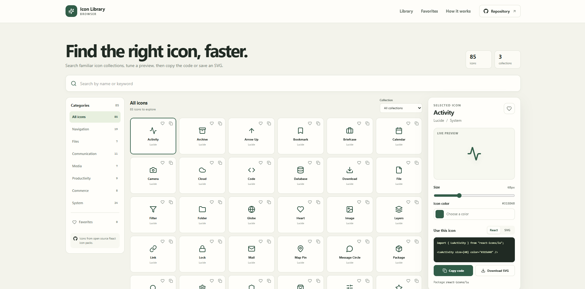

# Icon Library Browser

Icon Library Browser is a single-page catalog for finding interface icons from Lucide, Feather, and Font Awesome. Select an icon to adjust its size and color, copy a React snippet or SVG markup, or download an SVG file.

**GitHub Pages target:** [https://a2rp.github.io/icon-library-browser/](https://a2rp.github.io/icon-library-browser/) (deployment pending)

## What the app includes

- A fixed header with links to the library, saved favorites, and a short guide.
- A Repository link in the header that opens the project's GitHub repository.
- A curated catalog of 85 icons from three collections: Lucide, Feather, and Font Awesome.
- Search across icon names, collection names, categories, and related keywords.
- Category and collection filters, with the number of matching icons shown in the library.
- A selection panel with an adjustable color and size preview.
- React and SVG code views, a copy control, and an SVG download action.
- Favorite controls on each icon and in the selection panel. The Favorites filter shows saved icons.
- A small guide, a two-sided footer with profile and support links, and a Back to top button after scrolling more than 50px.
- Responsive layouts for desktop, tablet, and mobile screens.

## How to use the library

1. Type an icon name or keyword in the search field, choose a category, or select a collection.
2. Select a result to open it in the preview panel.
3. Adjust the icon size with the range control and choose a color with the color picker.
4. Choose React to copy a component import and JSX example, or choose SVG to copy the generated SVG markup.
5. Select **Download SVG** to save the current icon, size, and color as an SVG file.
6. Select the heart on an icon tile or in the preview panel to save it. Use Favorites to show saved icons.

The small copy control on each icon tile copies a React snippet at the default 24px size and the library's default green color. The main preview controls are used for the larger code example and downloaded file. If the browser blocks clipboard access, the app displays a message and leaves the code visible for manual copying.

## How data is stored

The catalog is a curated list bundled with the app. It does not make network requests. Favorite icon IDs are saved in local storage under `icon-library-browser-favorites`, so they remain in the current browser on the current device. Favorites are not synced between devices or visitors. Clearing the site's browser storage removes them. The selected icon, size, color, search, and filters are temporary and reset when the page reloads. If local storage is unavailable, the catalog and export controls can still be used, but favorites will not persist.

The app uses the `react-icons` package to render the three icon collections. The collection dropdown identifies the source package for the selected icon, which can be installed separately in a React project.

## Run locally

Install a current Node.js version, then run these commands from this folder:

```sh
npm install
npm run dev
```

Open the local address printed by Vite.

## Lint, build, and deploy

```sh
npm run lint
npm run build
npm run deploy
```

The deploy command runs the production build, then publishes the `dist` folder to the `gh-pages` branch. The intended GitHub Pages URL is [https://a2rp.github.io/icon-library-browser/](https://a2rp.github.io/icon-library-browser/). Vite uses `/icon-library-browser/` as its base path. Complete repository setup and deployment before treating this URL as live. Do not commit the generated `dist` folder to `main`.

## Future improvements

These are ideas for later work and are not implemented:

- Add more curated icon collections and expose collection licensing information.
- Add tags that can be edited or filtered independently from categories.
- Allow users to export a saved set of favorites as a JSON file.
- Add stroke width controls for outline icon collections.
- Add a shareable URL that restores a selected icon and preview settings.

## Links

- Portfolio: [https://www.ashishranjan.net](https://www.ashishranjan.net)
- GitHub: [https://github.com/a2rp](https://github.com/a2rp)
- CodePen: [https://codepen.io/ash1198](https://codepen.io/ash1198)
- LinkedIn: [https://www.linkedin.com/in/aashishranjan](https://www.linkedin.com/in/aashishranjan)
- Facebook: [https://www.facebook.com/theash.ashish/](https://www.facebook.com/theash.ashish/)
- YouTube: [https://www.youtube.com/@ashishranjan-ashz?sub_confirmation=1](https://www.youtube.com/@ashishranjan-ashz?sub_confirmation=1)
- Email: [mailto:ash.ranjan09@gmail.com](mailto:ash.ranjan09@gmail.com)

## Support

- Support: [https://a2rp-donation-page.netlify.app/](https://a2rp-donation-page.netlify.app/)
- Buy Me a Coffee: [https://buymeacoffee.com/ashishranjan](https://buymeacoffee.com/ashishranjan)
- Patreon: [https://www.patreon.com/ashishranjan](https://www.patreon.com/ashishranjan)
